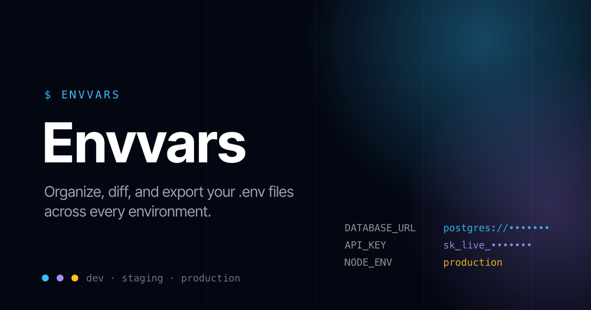

<p align="center">
  
</p>

# Envvars

Envvars is a spreadsheet for your `.env` files. It gives you one grid to hold every environment — Local, Staging, Production, or however your team names them — as columns, and every variable as a row, so you can see at a glance what's set, what's missing, and what's different between environments.

Everything runs entirely in your browser. There is no backend, no database, and no API call that carries your values off the page — state is kept in `localStorage` on the machine you're using. That makes Envvars a good fit for handling real secrets and config internally: nothing is transmitted or stored anywhere but the tab you're looking at.

## Why

Copy-pasting values between `.env` files, Slack messages, and password managers is error-prone — it's easy to miss a variable in staging, ship a stale `API_URL`, or lose track of which environment actually has `FEATURE_FLAG_X` turned on. Envvars turns that into a single sortable, diffable table with import/export built in, instead of juggling several text files by hand.

## Features

- **Spreadsheet-style grid** — variables as rows, environments as columns, with spreadsheet-style column letters (A, B, C…) and sticky headers/row numbers.
- **Missing-value detection** — a cell is highlighted red when a variable is set in at least one environment but missing in another, so gaps are obvious before they cause an incident.
- **Duplicate-name warnings** — flags variables accidentally defined twice.
- **Environments as columns** — add, rename, remove, resize, and drag-and-drop to reorder environments.
- **Sorting** — sort variables A→Z or Z→A by name.
- **Smart value styling** — booleans and URLs are colored and, for URLs, clickable.
- **Import** — paste or upload a `.env` or JSON file; format is auto-detected. Import into an existing environment or create a new one on the fly.
- **Export** — export a single environment as `.env` or JSON, or export multiple environments at once as CSV. Copy to clipboard or download.
- **Local persistence** — your sheet is saved to `localStorage` automatically and restored on your next visit. A "Reset" button restores the sample data.
- **No account, no server round-trip** — the entire app is client-rendered state; nothing you type is sent anywhere.

## Tech stack

- [TanStack Start](https://tanstack.com/start) (React 19, file-based routing via TanStack Router)
- [Tailwind CSS v4](https://tailwindcss.com/)
- [dnd-kit](https://dndkit.com/) for drag-and-drop column reordering
- [TanStack Virtual](https://tanstack.com/virtual) for row virtualization
- [Vite](https://vitejs.dev/) + [Cloudflare Vite plugin](https://developers.cloudflare.com/workers/framework-guides/web-apps/vite/) for building/deploying to Cloudflare Workers
- [Biome](https://biomejs.dev/) for linting/formatting, [Vitest](https://vitest.dev/) for tests

## Getting started

This project uses [pnpm](https://pnpm.io/). Install dependencies and start the dev server:

```bash
pnpm install
pnpm dev
```

The app runs at `http://localhost:3000`.

Other scripts:

```bash
pnpm build     # production build (client + SSR bundles)
pnpm preview   # serve the production build locally
pnpm test      # run the Vitest suite
pnpm check     # Biome lint + format check
```

## Deploying as an internal tool

Envvars ships pre-configured to deploy to [Cloudflare Workers](https://workers.cloudflare.com/) (see `wrangler.jsonc`). Because the app has no backend of its own, "deploying" just means putting the static/SSR bundle somewhere your team can reach it — the guides below cover the two most common setups.

### Option A: Cloudflare Workers (recommended, already configured)

1. Install Wrangler if you don't have it: `npm install -g wrangler`
2. Authenticate once per machine: `wrangler login`
3. Build and deploy:
   ```bash
   pnpm build
   wrangler deploy
   ```
   (or `pnpm run deploy`, which runs both steps — note the explicit `run`, since `pnpm deploy` alone invokes pnpm's own built-in deploy command instead of this script)
4. Wrangler prints the `*.workers.dev` URL for the deployment. To use a real internal domain, add a [custom domain route](https://developers.cloudflare.com/workers/configuration/routing/custom-domains/) in `wrangler.jsonc` or the Cloudflare dashboard.

**Restricting it to your team.** Envvars has no login screen by design — access control is expected to live in front of it. If your organization is on Cloudflare, the simplest way to make this an *internal* tool is [Cloudflare Access](https://developers.cloudflare.com/cloudflare-one/policies/access/):

1. In the Cloudflare Zero Trust dashboard, create an Access application pointed at your Workers route.
2. Add a policy that allows only your company's identity provider (Google Workspace, Okta, Entra ID, GitHub org, etc.) or a specific list of emails.
3. Once enabled, anyone hitting the URL is prompted to authenticate before the app ever loads — no code changes required.

### Option B: Self-hosted (VPN / internal network)

If your team isn't on Cloudflare, you can run the built app as a plain Node process behind whatever internal access control you already use (VPN, reverse proxy with SSO, IP allowlist, etc.):

```bash
pnpm build
pnpm preview --host 0.0.0.0 --port 4173
```

Run that under a process manager (`pm2`, `systemd`, a Docker container, etc.) and put it behind your internal reverse proxy (nginx, Caddy, Cloudflare Tunnel, Tailscale) so it's only reachable on your private network. Since there's no database or environment variable configuration required by the app itself, the only thing to manage is the process staying up.

### Data & privacy notes for internal deployments

- Envvars stores everything in the browser's `localStorage`, scoped per browser/device — it is **not** synced between teammates or devices. Treat it as a personal scratchpad for organizing values before distributing them (e.g. via your secrets manager), not a shared source of truth.
- Because state never leaves the browser, there's nothing to back up or secure server-side beyond restricting who can load the page at all (see the access-control notes above).
- Clearing browser storage (or using a different browser/device) will reset the sheet to the sample data.

## Project structure

```
src/
  routes/
    __root.tsx    # document shell, SEO/Open Graph metadata
    index.tsx     # the single page — renders EnvVarSheet
  components/
    EnvVarSheet.tsx           # the grid: state, persistence, sorting, DnD
    ImportVariablesModal.tsx  # .env / JSON import
    ExportVariablesModal.tsx  # .env / JSON / CSV export
```

Routes are file-based (via TanStack Router) — add a new file under `src/routes` to add a page.

## Learn more

- [TanStack Start docs](https://tanstack.com/start)
- [TanStack Router docs](https://tanstack.com/router)
- [Cloudflare Workers docs](https://developers.cloudflare.com/workers/)
